Layout
======

Grootste beperking: **boogstralen**

Fleischmann:
- R1 = 19.2 cm
- R2 = 22.6 cm
- D1 = 38.4 cm
- D2 = 45.1 cm

Billy plank is max 38 cm diep.

Conclusie:
- *Meer dan 1 Billy plank nodig om een lus te kunnen maken!*
- *Enkele Billy plank kan alleen een pendelbaan zijn*

---

Tafel:
- 120 x 70 cm

Billy planken:
- 76 x 38 cm (in kast)
- 76 x 26 cm
- 36 x 38 cm
- 36 x 26 cm

Een 76cm plank past net op de diepterichting van de tafel (met wat overhang).

Twee 76cm planken passen aan elkaar op de lengterichting van de tafel (met wat overhang).

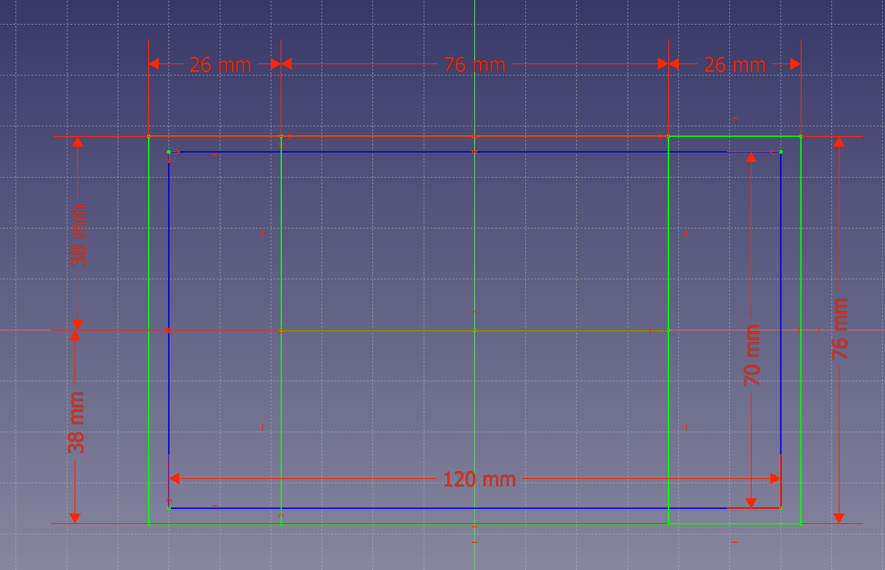

---

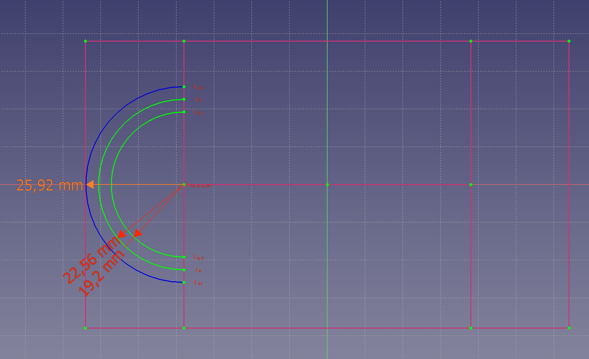

Op de ondiepe Billy plank passen net R1 en R2. Voor een derde boog is geen ruimte.

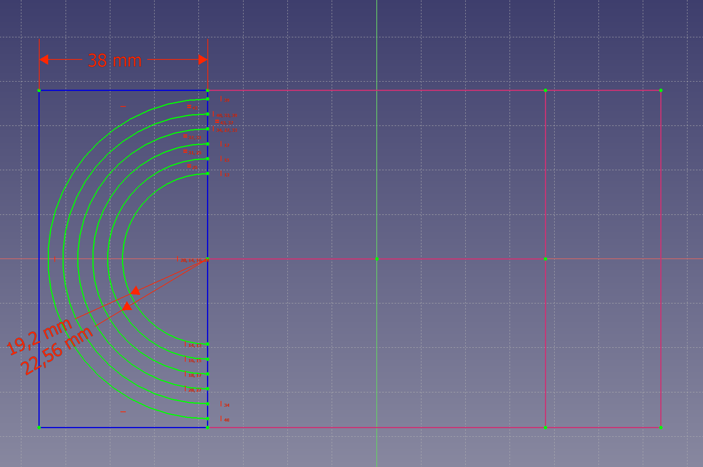

Op de diepe Billy plank passen meer bogen (5 à 6), maar die hangt gevaarlijk ver over de rand van de tafel.

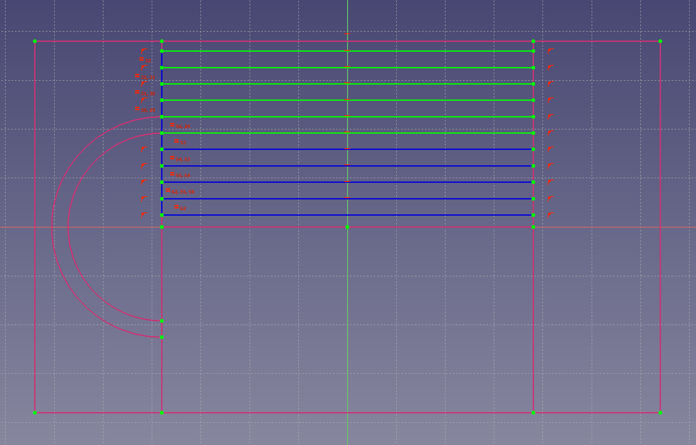

Op een 38 cm-diepe Billy plank passen 11 parallelle sporen. Sporen binnen R1 zijn moeilijk bereikbaar. De overige 6 sporen zijn makkelijker bereikbaar.

Op 2 planken van 38 cm diep is in totaal ruimte voor 12 'makkelijk' bereikbare sporen. Door de minimale ovaal omhoog- of omlaag te schuiven kunnen deze sporen tussen de twee planken verdeeld worden.

Op de achterste plank zou eventueel ook een traverse als schaduwstation gemaakt kunnen worden. Deze heeft de grootste capaciteit als de binnenkomende sporen op het midden van de plank liggen.

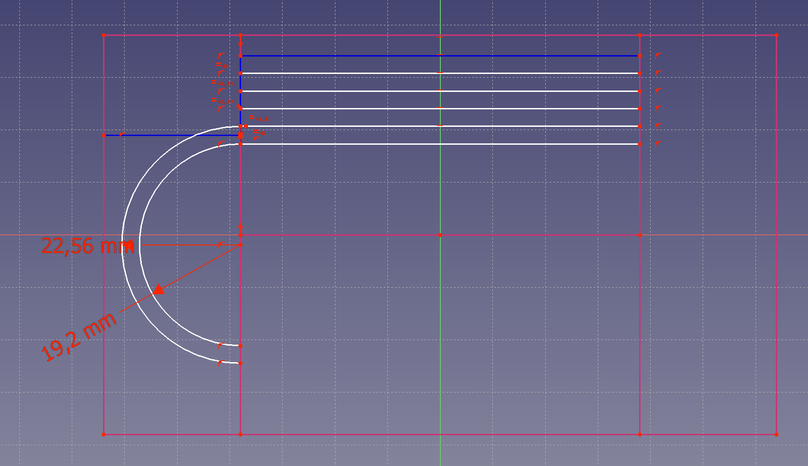

In dat geval zouden er 6 sporen op de traverse passen. Of 5 als elk spoor op de traverse op elk hoofdspoor aan moet kunnen sluiten.

---

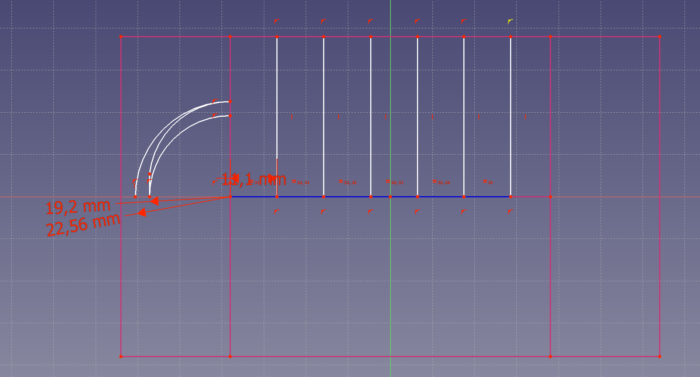

Een Fleischmann wissel is 11.1 cm lang. Op een 76 cm Billy plank is dus ruimte voor 6 wissels.

Een boogwissel heeft een hoek van 45 graden. Er past dus 1 wisselpaar in een 90-graden boog.

De langste trein die ik verwacht te rijden (1600 + 3 ICR) is ~61 cm lang. Op een Billy plank van 76 cm zou er dan ruimte overblijven voor **1 wissel**. Stations zullen daarom vooral wissels in de bogen moeten plaatsen.

---

Ook hellingen zijn erg moeilijk op een kleine oppervlakte.

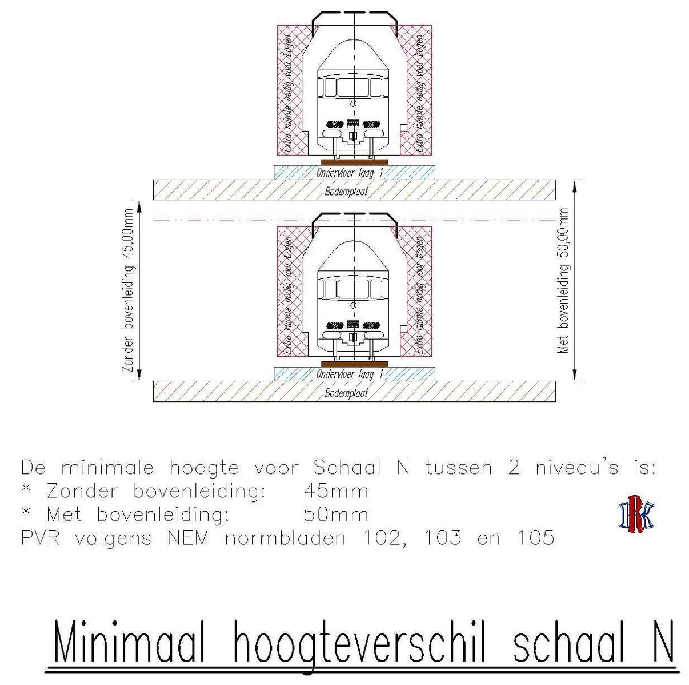
*Bron: https://encyclopedie.beneluxspoor.net/index.php/Hellingen/Klimspiralen*

Het minimale hoogteverschil voor N is **~50mm**.

Het maximale steigingspercentage in Nederland is 6%. Aangezien mijn treinen kort zijn en niet vaak zullen rijden is dit waarschijnlijk haalbaar. In dat geval is een helling nodig van **83 cm**, of een dubbele helling van **42 cm**.

De minimale boog over 180 graden is **60 cm** lang.
- Met een dubbele helling is alleen de boog al genoeg om sporen te laten kruisen. Deze zou dus op 1 Billy plank passen.
- Voor een enkele helling is **24 cm** extra nodig.

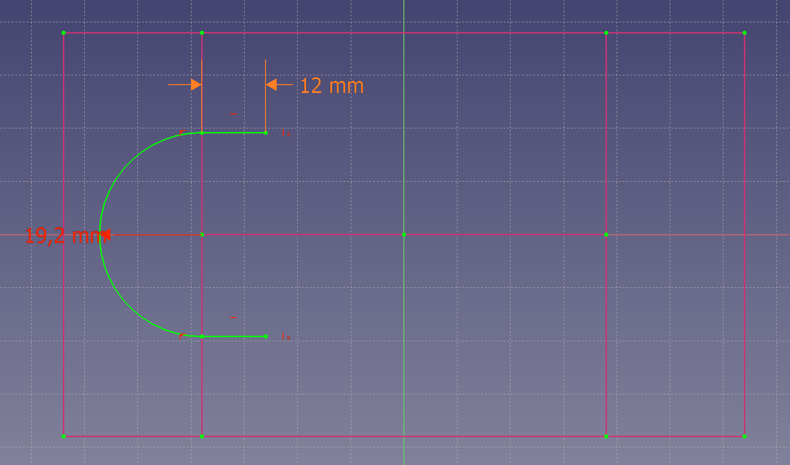

---

**Grondvormen**

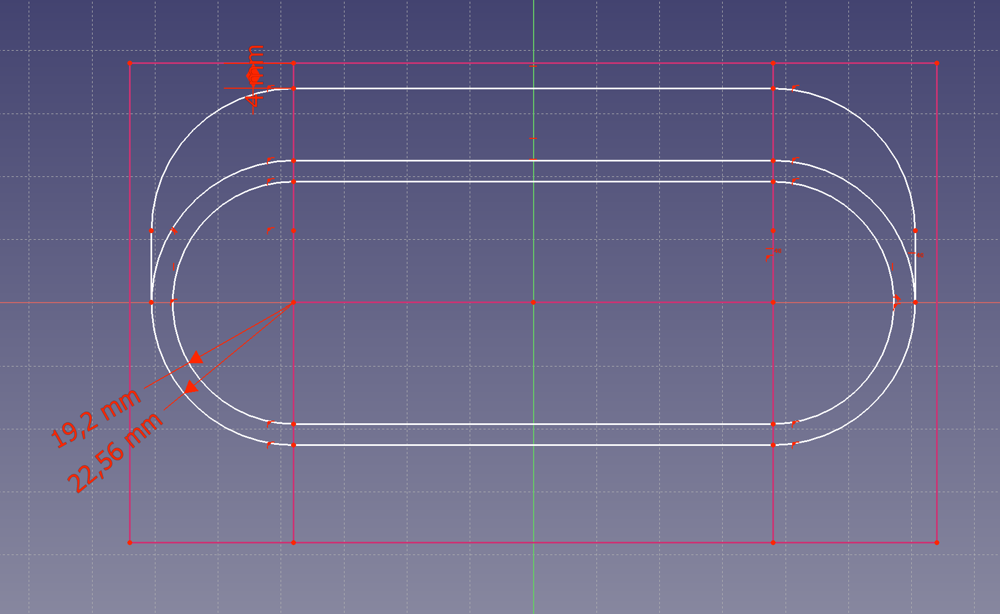
**Ovaal**. Simpel. Past goed op losse modules.

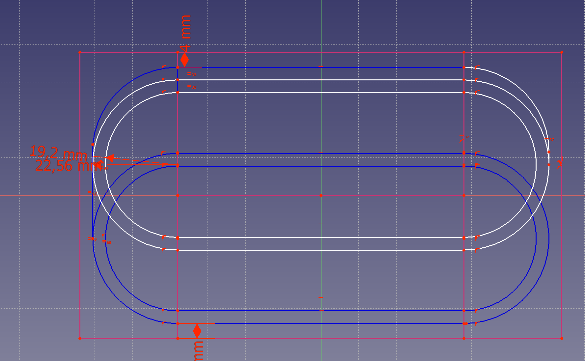
**Twee ovalen**. Meer variatie. Maar sluit niet goed aan op modules.

De helling aan de achterkant is ~106 cm. Het hoogteverschil tussen de niveaus is daardoor ~6cm. Dat is genoeg om te kruisen, *maar te weinig voor een bereikbaar schaduwstation*. Daarvoor zou wel ruimte gemaakt kunnen worden op beide niveaus aan de achterkant van de baan.

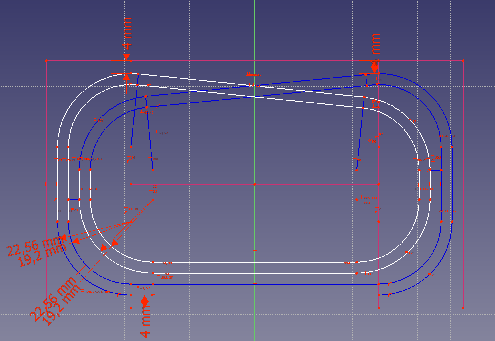

**Dubbel ovaal**. Meer rijlengte. Sluit niet goed aan op module-overgangen. Module met fly-over nodig.